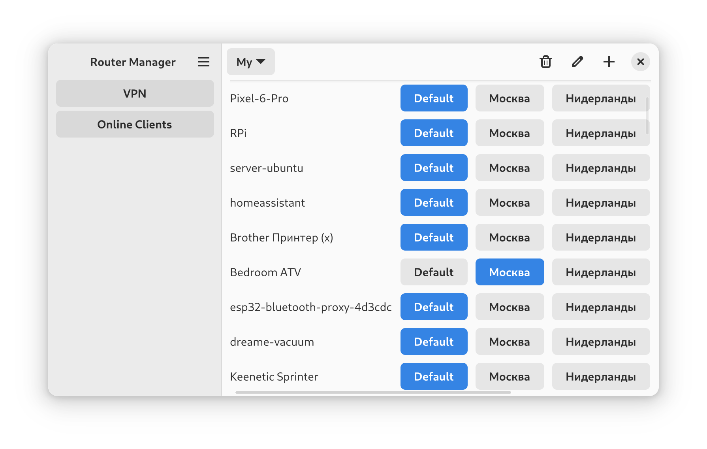
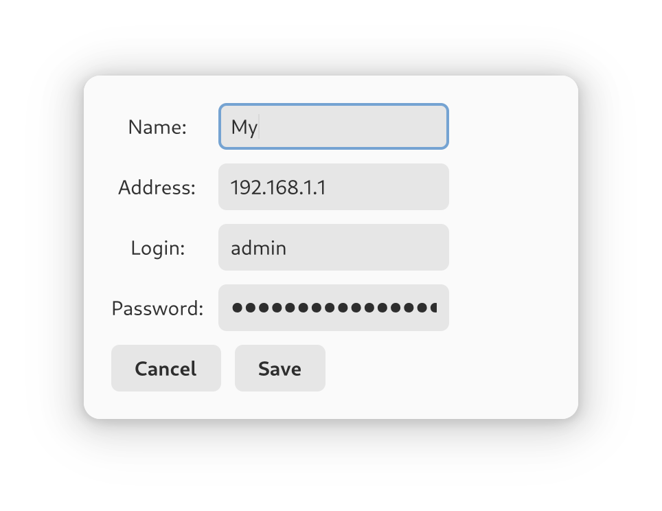

# Keenetic Manager 

<em>Управление политиками клиентов на роутерах Кинетик</em>

<p align="center">
    
</p>

<p align="center">
    <a href='https://flathub.org/apps/ru.toxblh.KeeneticManager'>
        
    </a>
</p>

<p align="center" style="">
  
  
  
</p>

## Установка

```bash
git clone https://github.com/Toxblh/Keenetic-Manager.git
cd Keenetic-Manager
pip3 install -r requirements.txt
make setup
make install
```

Добавьте роутер, нажав "+"

Укажите ваш IP адрес или KeenDNS.

_KeenDNS пример: `https://XXXX.keenetic.link` где XXXX ваш поддомен._

<p align="center">
    
</p>

Всё готово, выберите пункт меню.
