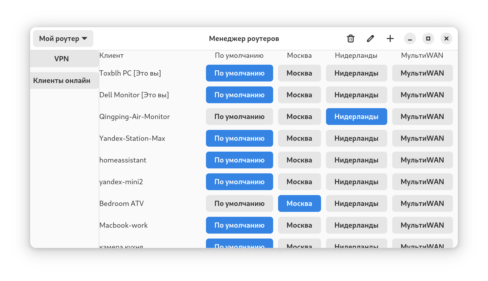
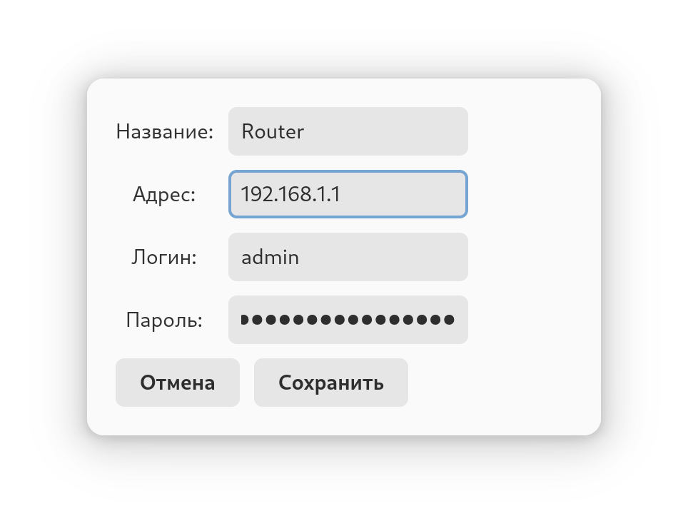

# Keenetic Manager



## Требования
Python 3.x
Установленные библиотеки (если используются дополнительные библиотеки, укажите их здесь)

## Установка

Склонируйте репозиторий:
```bash
git clone https://github.com/Toxblh/Keenetic-Manager.git
cd Keenetic-Manager
```

Установите необходимые зависимости:
```bash
pip3 install -r requirements.txt
```

## Использование

```bash
python3 ./main.py
```

Добавьте роутер нажав "+"
Укажите ваш IP адрес. KeenDNS НЕ РАБОТАЕТ!



И можете начать управлять выбрав категорию.